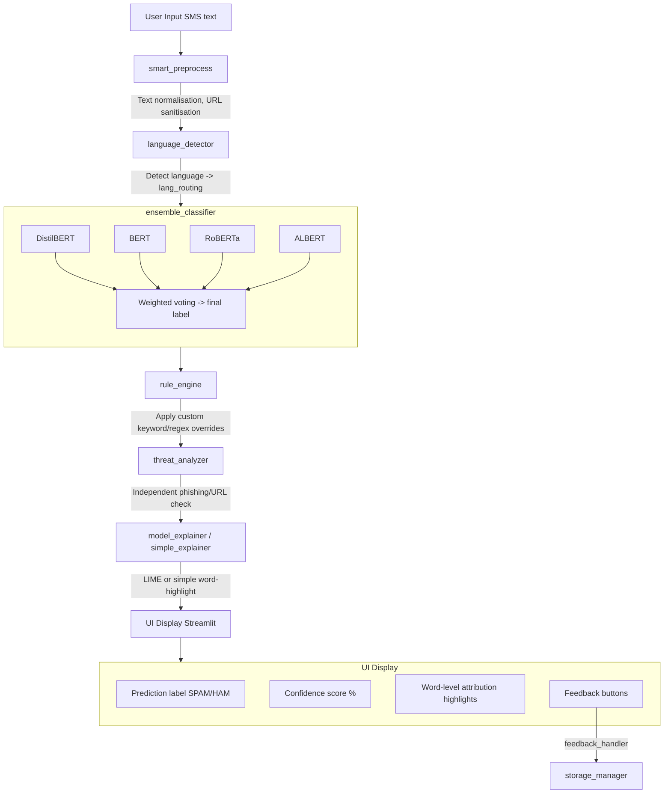

# 🏗️ Spamlyser — Architecture Documentation

> This document provides a high-level overview of the Spamlyser codebase: its tech stack, folder structure, component responsibilities, and data flow. It is intended to help new contributors understand how the system fits together before diving into the code.

---

## 📚 Table of Contents

- [Tech Stack](#tech-stack)
- [Folder Structure](#folder-structure)
- [Component Overview](#component-overview)
- [Data Flow](#data-flow)
- [ML Model Pipeline](#ml-model-pipeline)
- [External Integrations](#external-integrations)
- [Configuration](#configuration)

---

## 🧰 Tech Stack

| Layer | Technology | Purpose |
|:---|:---|:---|
| **UI / Frontend** | [Streamlit](https://streamlit.io/) `>=1.59` | Web application framework — renders all pages and interactive widgets |
| **ML Inference** | [Hugging Face Transformers](https://huggingface.co/docs/transformers) `>=5.14` | Runs DistilBERT, BERT, RoBERTa, ALBERT models for spam classification |
| **Deep Learning** | [PyTorch](https://pytorch.org/) `>=2.13` | Backend tensor computation engine for all Transformer models |
| **Data Processing** | [Pandas](https://pandas.pydata.org/) `>=3.0`, [NumPy](https://numpy.org/) `>=1.26` | CSV/dataset handling, numerical operations |
| **Visualisation** | [Plotly](https://plotly.com/python/) `>=6.9` | Interactive charts on analytics and trend dashboards |
| **Explainability** | [LIME](https://github.com/marcotcr/lime) `>=0.2` | Local model explanations — shows which words drive the spam classification |
| **ML Utilities** | [scikit-learn](https://scikit-learn.org/) `>=1.9` | Calibration, evaluation metrics, preprocessing helpers |
| **PDF Reports** | [fpdf2](https://py-fpdf2.readthedocs.io/) `>=2.8` | Generates encrypted PDF export reports |
| **Security** | [cryptography](https://cryptography.io/) `>=49.0` | Encrypts exported reports |
| **Testing** | [pytest](https://pytest.org/) `>=9.1`, pytest-cov | Unit and integration testing |
| **Linting / Formatting** | [Ruff](https://docs.astral.sh/ruff/) | Fast Python linter and formatter (see `ruff.toml`) |
| **Pre-commit** | [pre-commit](https://pre-commit.com/) | Runs Ruff and other checks automatically before each commit |
| **Containerisation** | [Docker](https://www.docker.com/) | Reproducible deployment via `Dockerfile` |
| **NLP Utilities** | [sentencepiece](https://github.com/google/sentencepiece), protobuf | Tokenisation support for ALBERT and other models |

---

## 📁 Folder Structure

```
Spamlyser/
│
├── app.py                      # 🚀 Main Streamlit entry point — renders the primary classification UI
├── config.py                   # ⚙️  Global settings: model names, thresholds, feature flags
├── page_functions.py           # 🔧 Shared utility functions used across multiple pages
├── pyproject.toml              # 📦 Project metadata, pytest & mypy config
├── ruff.toml                   # 🎨 Ruff linter/formatter configuration
├── requirements.txt            # 📋 Production dependencies
├── requirements-dev.txt        # 🧪 Development/testing-only dependencies
├── Dockerfile                  # 🐳 Container build instructions
│
├── pages/                      # 📄 Streamlit multi-page app — each file is a separate page
│   ├── analytics_dashboard.py  # Spam/ham distribution charts and session stats
│   ├── anomaly_dashboard.py    # Out-of-distribution and anomalous message detection
│   ├── benchmark_dashboard.py  # Side-by-side model performance comparison
│   ├── trend_analytics.py      # Time-series spam trend visualisation
│   ├── rules_editor.py         # Custom keyword/regex rule management UI
│   ├── theme_customizer.py     # App theme configuration UI
│   └── what_if_playground.py   # Interactive "what-if" scenario editor
│
├── models/                     # 🧠 Business logic and ML pipeline
│   ├── model_init.py           # Loads and caches HuggingFace models on startup
│   ├── ensemble_classifier_method.py  # Core ensemble (DistilBERT + BERT + RoBERTa + ALBERT)
│   ├── language_detector.py    # Detects the language of incoming SMS messages
│   ├── lang_routing.py         # Routes messages to the appropriate language model
│   ├── smart_preprocess.py     # Text cleaning and normalisation pipeline
│   ├── threat_analyzer.py      # Identifies phishing/malicious URL patterns
│   ├── word_analyzer.py        # Token-level frequency and keyword analysis
│   ├── rule_engine.py          # Applies custom user-defined rules on top of ML output
│   ├── feedback_handler.py     # Saves and processes user feedback (correct/incorrect predictions)
│   ├── storage_manager.py      # Persistent storage for results, feedback, sessions
│   ├── batch_processor.py      # Handles CSV bulk-upload and batch inference
│   ├── export_feature.py       # PDF/CSV export generation logic
│   ├── session_analytics.py    # Tracks per-session stats and aggregations
│   ├── anomaly_detector.py     # Statistical anomaly detection on message patterns
│   ├── model_explainer.py      # LIME-based feature attribution for individual predictions
│   ├── simple_explainer.py     # Lightweight word-highlight explanation (no LIME)
│   ├── calibration.py          # Probability calibration for model confidence scores
│   ├── sender_reputation.py    # Tracks per-sender spam rate over time
│   ├── webhook_notifier.py     # Sends POST notifications to configured webhooks
│   ├── db_connection_pool.py   # SQLite connection pooling for persistent data
│   └── ...                     # Additional utility modules
│
├── tests/                      # ✅ Pytest test suite
│   └── ...                     # Unit tests for models, rules, preprocessing etc.
│
├── benchmarks/                 # 📊 Model benchmarking scripts and results
├── docs/                       # 📖 Additional documentation assets
├── assets/                     # 🖼️  Static files (CSS, images used in UI)
├── imgs/                       # 🖼️  Logo and screenshot images
├── scripts/                    # 🔨 Helper scripts (data prep, migrations etc.)
└── .github/                    # 🤖 GitHub Actions workflows and issue/PR templates
```

---

## 🧩 Component Overview

### 1. Entry Point — `app.py`
The primary Streamlit page. Handles:
- Single-message classification UI
- Model selection (DistilBERT / BERT / RoBERTa / ALBERT / Ensemble)
- Real-time prediction with confidence scores
- Word-level explainability display
- Feedback collection

### 2. Multi-Page System — `pages/`
Streamlit automatically discovers Python files in `pages/` and renders them as sidebar navigation items. Each page is self-contained and imports shared utilities from `page_functions.py` and `models/`.

### 3. Model Layer — `models/`
All ML and business logic lives here. Key components:

| Module | Responsibility |
|:---|:---|
| `model_init.py` | Loads models from HuggingFace Hub, uses `@st.cache_resource` to avoid reloading |
| `ensemble_classifier_method.py` | Combines predictions from all 4 models via weighted voting |
| `smart_preprocess.py` | Normalises URLs, phone numbers, special characters before inference |
| `rule_engine.py` | Post-processes ML output with user-defined regex/keyword rules |
| `threat_analyzer.py` | Flags phishing keywords and suspicious URL patterns independently of ML |
| `storage_manager.py` | Manages SQLite-backed persistent storage for history and feedback |

### 4. Configuration — `config.py`
Centralises all tunable settings:
- Model names / HuggingFace repo paths
- Classification thresholds
- Feature flags (enable/disable pages)
- Webhook endpoints
- Storage paths

---

## 🔄 Data Flow



---

## 🤖 ML Model Pipeline

Spamlyser uses **4 fine-tuned Transformer models** sourced from HuggingFace:

| Model | Base Architecture | Strengths |
|:---|:---|:---|
| **DistilBERT** | DistilBERT (66M params) | Fast inference, good for real-time use |
| **BERT** | BERT-base-uncased (110M) | Strong general language understanding |
| **RoBERTa** | RoBERTa-base (125M) | Robustly optimised, handles noisy text well |
| **ALBERT** | ALBERT-base-v2 (12M) | Lightweight, parameter-efficient |

The **Ensemble** mode combines all 4 using **weighted soft voting** on the probability distributions, producing the most robust final prediction.

All models are loaded once at startup via `model_init.py` using Streamlit's `@st.cache_resource` decorator to avoid repeated downloads.

---

## 🔗 External Integrations

| Integration | Module | Description |
|:---|:---|:---|
| **HuggingFace Hub** | `model_init.py` | Downloads pre-trained model weights on first run |
| **Webhooks** | `webhook_notifier.py`, `webhook_queue.py` | Sends spam alerts to configured HTTP endpoints |
| **SQLite** | `db_connection_pool.py`, `storage_manager.py` | Local persistent storage for history, feedback, and session data |
| **Streamlit Cloud / HuggingFace Spaces** | `app.py` | Deployment target (see `README.md`) |

---

## ⚙️ Configuration

Key files that control runtime behaviour:

| File | Purpose |
|:---|:---|
| `config.py` | Master settings file — model paths, thresholds, feature flags |
| `.env.example` | Template for environment variables (copy to `.env`) |
| `ruff.toml` | Linting and formatting rules |
| `.pre-commit-config.yaml` | Pre-commit hook pipeline |
| `.editorconfig` | Editor-level whitespace/indent settings |
| `pyproject.toml` | pytest and mypy configuration |

---

## 🤝 Contributing

Before submitting a PR, please:
1. Read [`CONTRIBUTING.md`](CONTRIBUTING.md)
2. Run `ruff check .` and `ruff format .` to lint/format your code
3. Ensure all tests pass: `pytest`
4. Follow the PR template in `.github/PULL_REQUEST_TEMPLATE.md`
